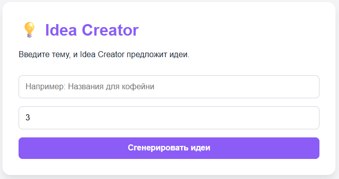
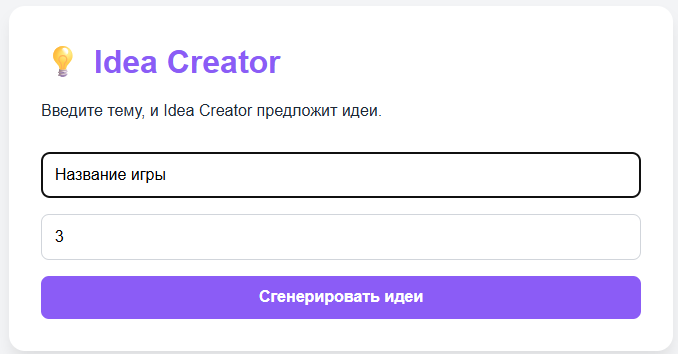
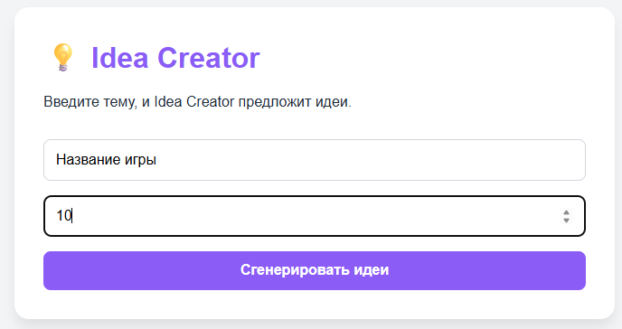
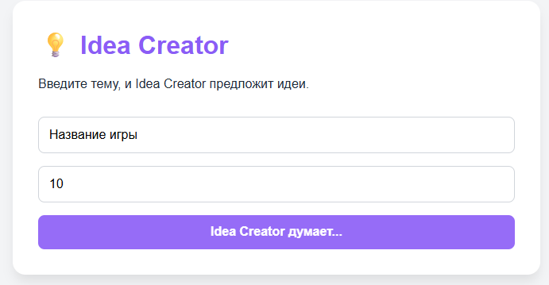
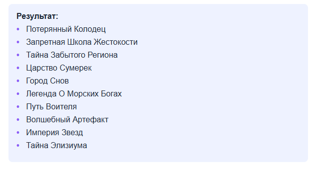
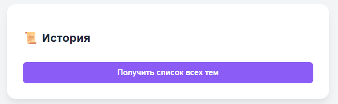
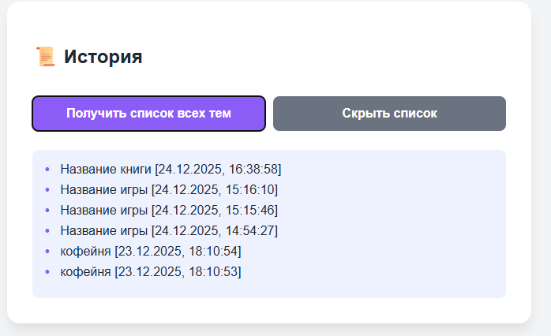

# Idea Creator 

Веб-приложение для генерации списков идей на заданную тему с помощью искусственного интеллекта.

## Предварительные требования
- Docker и Docker Compose
- Локально развернутая LLM модель Mistral
- База данных PostgreSQL
- Разработка с использованием фреймворка FastAPI

## Настройка LLM модели

### Запустите модель на порте 11434
- Например, через Ollama

## Запуск приложения

### Клонируйте репозиторий и запустите проект
В папке, где хотите разместить проект, введите команду
```
git clone <git@github.com:maks1m-2608/CW-2025.git>
```
Затем перейдите в появившуюся папку и введите (для первого запуска):
```
docker compose up -d --build
```
Для последующих запусков:
```
docker compose up -d
```
### Готово! веб-приложение начало работать!

## Откройте приложение в браузере
```
http://localhost:8000
```

## Структура данных
База данных:
```
postgres_data/ (PostgreSQL)
```
LLM:
```
http://172.22.16.1:11434
```

### Работа с базой данных
Для просмотра базы данных откройте второй терминал, не прерывая работы приложения и введите команду
```
docker exec -it <brainstorm_db_cont> psql -U <buddy_user> -d <brainstorm_db>
```
где:
- brainstorm_db_cont - название контейнера с БД
- buddy_user - имя пользователя
- brainstorm_db - название БД

Для просмотра содержимого введите команду:
```
SELECT t.title AS "Тема", string_agg(i.text, ', ') AS "Список идей"
FROM topics t
JOIN ideas i ON t.id = i.topic_id
GROUP BY t.id, t.title
ORDER BY t.created_at DESC;
```

Для просмотра всех тем: 
```
SELECT * FROM topics;
```

Для просмотра всех идей: 
```
SELECT * FROM ideas;
```

Очистить базу данных:
```
TRUNCATE topics, ideas RESTART IDENTITY CASCADE;
```

Выйти:
```
\q
```

## ✨ Возможности

- **Генерация идей** - Генерируйте идеи на выбранную тему
- **Выбор количества идей** - Выбирайте нужно количество идей (до 10)
- **История преобразований** - Автоматическое сохранение истории всех генераций
- **Дружелюбный интерфейс** - Минималистичный и удобный дизайн

## Старт приложения


## Ввод темы для получения идей
- Введите название темы для генерации идей


## Выбор количества генерируемых идей
- Выберите количество генерируемых идей


## Запуск процесса генерации
- Нажмите на кнопку "Сгенерировать идеи"


## Получение результатов
- Получите результат в окне ниже


## История генераций
Раздел "История генераций" показывает:
- Тема для генерации идей
- Дата и время операции
**Все генерации автоматически сохраняются** в базу данных
Для просмотра истории генераций нажмите кнопку **Получить список всех тем**



Для закрытия списка всех сгенерированных тем нажмите кнопку **Скрыть список**

## Совместимость:
- Все современные браузеры (Chrome, Firefox, Safari, Edge)
- Мобильные устройства и планшеты

## Возможные ошибки и их решение

### Ошибка при запуске приложения


**Ошибка:**
Error response from daemon: failed to set up container networking: driver failed programming external connectivity on endpoint brainstorm_db_cont (8355d797e534deec7f9109fea0191f11afa55fbad6e09fa6ecb9066ace1ef4ab): failed to bind host port for 0.0.0.0:5432:172.20.0.2:5432/tcp: address already in use

**Причина:**
Эта ошибка **address already in use** означает, что порт 5432 (стандартный порт PostgreSQL) уже занят другим процессом в вашей системе.

**Решение:**
Обычно достаточно остановить сторонний процесс командой:
```
sudo service postgresql stop
```

### Ошибка времени ожидания при генерации идей


**Ошибка:**
Error: Request timed out.

**Причина:**
Эта ошибка **Request timed out** означает, что превышено время ожидания ответа. Скорее всего причиной является то, что вы забыли запустить локальную LLM на своей устройстве.

**Решение:**
Запустите локальную LLM через Ollama